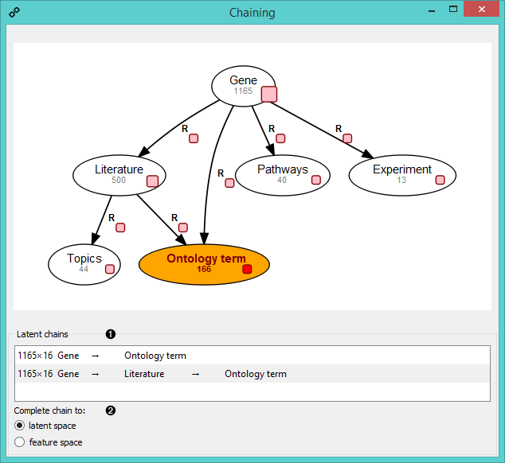
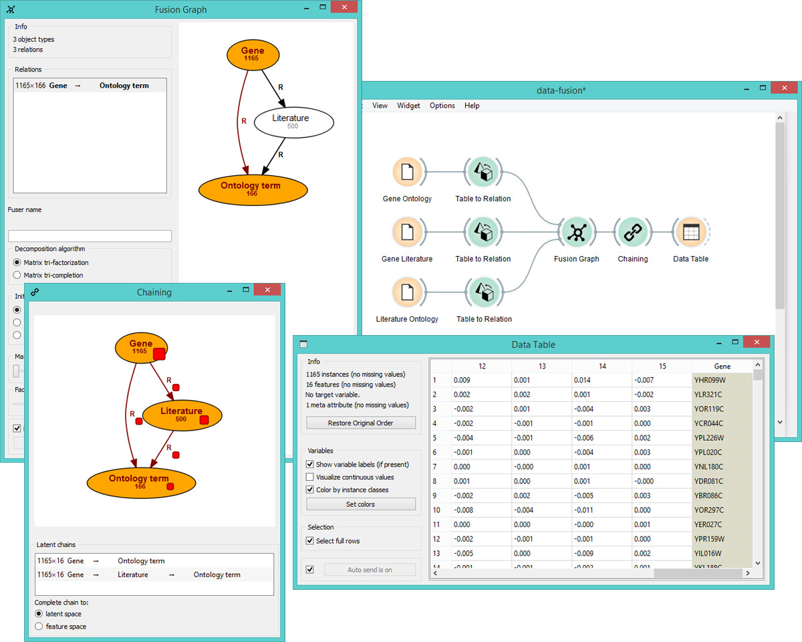

Chaining
========

Profiles objects of one type in the latent space of another object type through chaining of 
latent matrices along paths in a data fusion graph.

Signals
-------

**Inputs**:

- **Fitted Fusion Graph**

  Fitted collective latent data model.

**Outputs**:

- **Relation**

  Relationships between two groups of objects.

Description
-----------

**Chaining** constructs data profiles of objects of one type that are expressed in the latent 
space of another object type. This is done by appropriately multiplying the latent matrices along
paths that connect start and end nodes in the fusion graph. The widget displays a fitted fusion graph on the right,
where you can select the start and end node (object type) that are then used in chaining.

1. The widget displays all chains that connect selected start node with the selected end node (in orange).
   Click on the chain you wish to output.
2. Select what type of chain you wish to output:
   - **latent space** (widget outputs data profiles in the latent space)
   - **feature space** (widget outputs data profiles in the original domain space)

Example
-------

This widget is great for constructing profiles that relate objects, which are not directly
connected in a fusion graph. In the example below we have three data sets: annotations of genes
from the Gene Ontology, literature on genes and literature on ontology terms. 
We use **Chaining** to see how genes relate to ontology terms.

