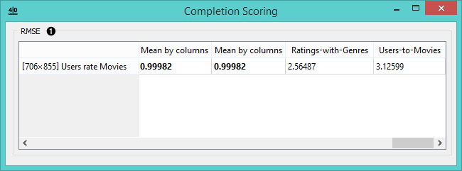

Completion Scoring
==================

Scores the quality of matrix completion using root mean squared error (RSME).

Signals
-------

**Inputs**:

- **Fitted fusion graph**

  Fitted collective matrix.

- **Relation**

  Relations between two groups of objects.

**Outputs**:

- (None)

Description
-----------

This widget compares the quality of matrix optimization based on root mean squared error value
([RMSE](https://en.wikipedia.org/wiki/Root-mean-square_deviation)). Scores will be displayed as
attributes, which you can name in previous widgets (**Fusion Graph**).

1. The RMSE value chart for the input relation matrix.

Example
-------

