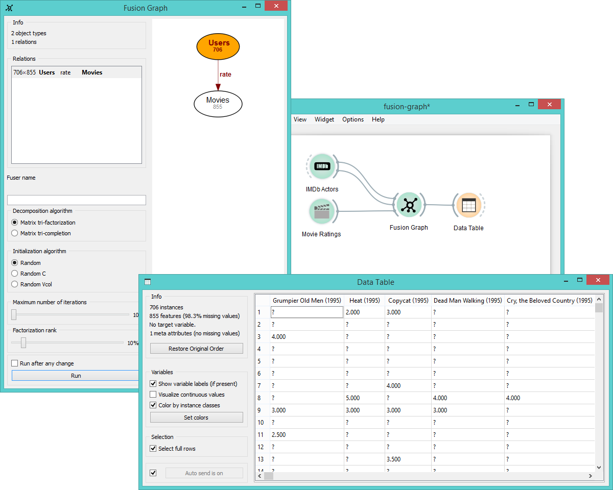

Fusion Graph
============

Fusion of input data sets into a collective matrix.

Signals
-------

**Inputs**:

- **Relation**

  Relations between two groups of objects.  

**Outputs**:

- **Relation**

  Relations between two groups of objects.

- **Fitted Fusion Graph**

  Fitted collective matrix.

- **Fusion Graph**

  Collective matrix.

Description
-----------

**Fusion Graph** widget fuses multiple graphs into a single unified matrix. It can take several data sets as input
and return a relational structure of the entire data system in a matrix.

1. Information on the input (object types are nodes, relations are links between the nodes).
2. List of identified relations. Click on the relation to output it.
3. Define fuser name under which you will identify the fused data.
4. Select the algorithm for [factorization](https://en.wikipedia.org/wiki/Non-negative_matrix_factorization):
   - **matrix tri-factorization** will decompose the matrix into three latent matrices and fuse them into a 
     reconstructed matrix (missing values will be imputed as a specific value)
   - **matrix tri-completion** works the same as tri-factorization, but it ignores the missing values
5. Select the *initialization algorithm* for matrix optimization.
6. Set the *maximum number of iterations* for matrix optimization. Default is 10.
7. Set the *factorization rank* (the ratio of data compression based on the input data). Default is 10%.
8. If *Run after every change* is ticked, the widget will automatically commit changes. Alternatively press *Run*. 
  For large data sets we recommend to commit the changes manually.

Example
-------

The example below shows how to fuse several data sets together. Say we have the data on
ontology terms for several genes, literature on ontology terms and literature on genes.
To fuse these data together we use **Table to Relation** widget, where you manually set
the attribute and relation names. **Fusion Graph** will draw relations between these names,
display the connections and perform a selected decomposition method.

