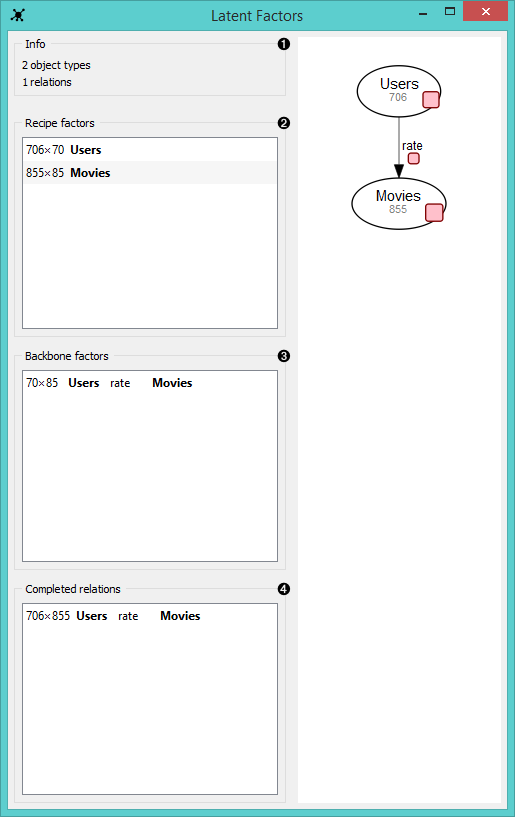

Latent Factors
==============

Draws data fusion graph with the estimated latent factors overlaid. Outputs latent factors for further analysis.

Signals
-------

**Inputs**:

- **Fitted fusion graph**

  Fitted collective latent data model.

**Outputs**:

- **Relation**

  Selected latent data matrix or a completed relation.

Description
-----------

**Latent Factors** widget displays the fusion graph together with the backbone and recipe
matrices estimated by collective matrix factorization. 

Fused data from the widget input are decomposed into latent factors, which
serve as components for subsequent matrix reconstruction. You would normally
draw this widget from **Fusion Graph** and feed its output (a backbone matrix,
a recipe matrix or a completed relation) into widgets for downstream data analysis,
such as **Hierarchial Clustering** or **Heat Map**.

1. Information on the input (object types are nodes, data relations are links between the nodes).
2. A list of **recipe factors** (latent matrices containing compressed representation of object types).
   Recipe factors encode latent components of respective object types.
3. A list of **backbone factors** (latent matrices containing compressed representation of data relations).
   Backbone factors encode interactions between the latent components.
4. A list of **completed relations** (completed relation matrices obtained by multiplying the corresponding latent matrices).

Example
-------

In the example below we demonstrate how 8 separate [yeast](data-yeast) 
data sets are fused together in **Fusion Graph** and then decomposed 
into latent factors with **Latent Factors** widget.

