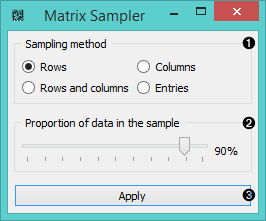

Matrix Sampler
==============

Samples a relation matrix.

Signals
-------

**Inputs**:

- **Data**

  Data set.

**Outputs**:

- **In-sample Data**

  Selected data.
  
- **Out-of-the-sample Data**

  Remaining data.

Description
-----------

This widget samples the input data and sends both the sample and the remaining
data to the output. It is especially useful for testing the performance of recommendation
systems.

1. Select the desired *sampling method*:
   - **rows** (samples from the matrix by y-axis)
   - **columns** (samples from the matrix by x-axis)
   - **rows and columns** (samples from the entire matrix)
   - **entries** (samples from all the entries)
2. Select the proportion of the data you want in the output.
3. Press **Apply** to commit the changes.

Example
-------

