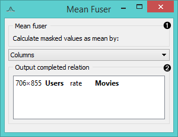
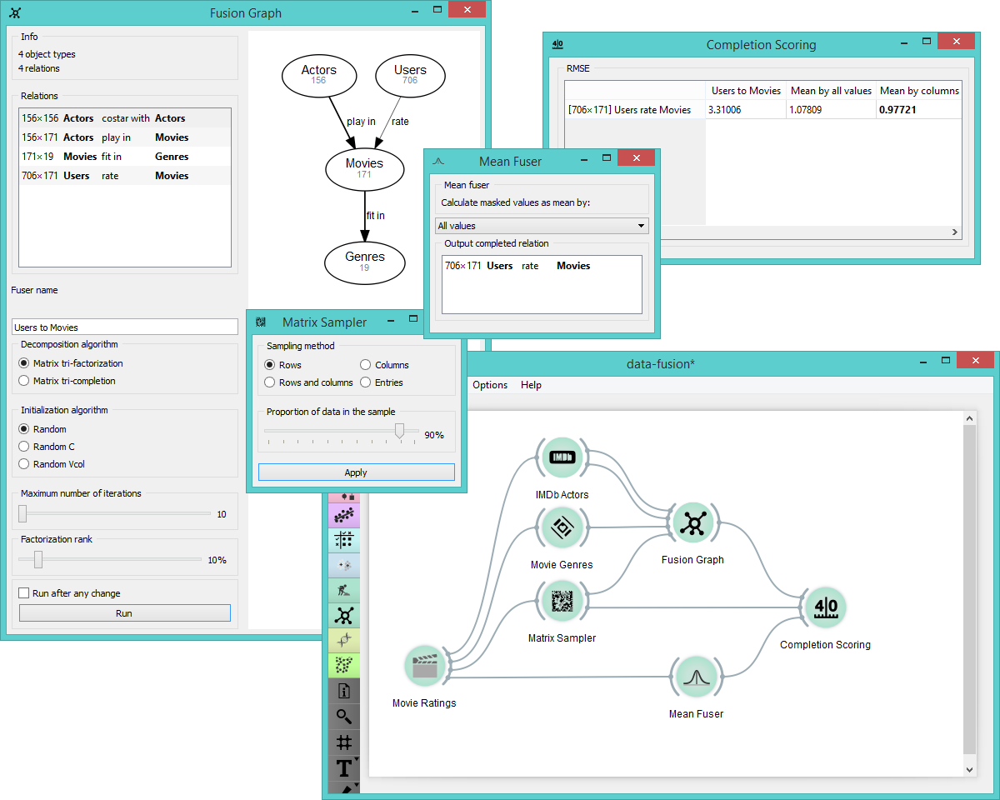

Mean Fuser
==========

Constructs a mean fusion graph.

Signals
-------

**Inputs**:

- **Fusion Graph**

  Collective matrix.
  
- **Relation**

  Relations between two groups of objects.

**Outputs**:

- **Mean-fitted fusion graph**

  Mean-fitted collective matrix.

- **Relation**

  Relations between two groups of objects.

Description
-----------

The widget calculates latent mean values from the input matrix.

1. Select the factor for mean calculation:
   - **rows**
   - **columns**
   - **all**
2. Output completed relations for a selected matrix.

Example
-------

**Mean Fuser** widget is useful for comparing RMSE values in
**Completion Scoring** widget for the input data set. In the example
below we have selected a subset, fed it into **Fusion Graph** and
from there into **Completion Scoring** for evaluation. We also fed the
out-of-the-sample data from **Matrix Sampler** and the mean values
from **Mean Fuser** into the widget for scoring.

