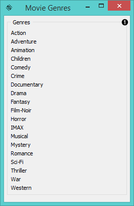
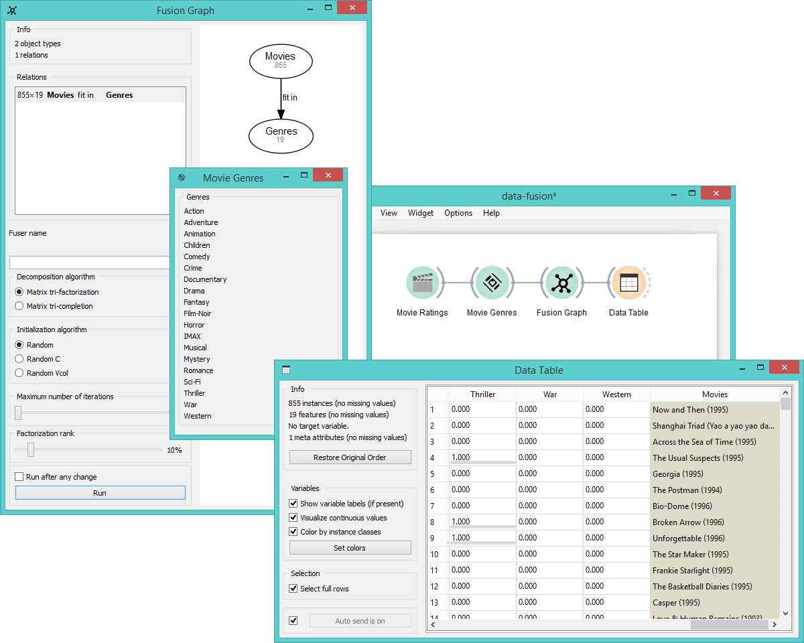

Movie Genres
============

Constructs a movies-by-genres or actors-by-genres relation matrix.

Signals
-------

**Inputs**:

- **Row type**

  Instances from the input data.

**Outputs**:

- **Genres**

  Data-by-genres relation matrix.

Description
-----------

This widget matches movies or actors to movie genres and forms a relation matrix.
It is used to obtain information about the genres to which movies in the input belong or 
about genres that are associated with actors given in the input.

1. A list of movie genres included in the MovieLens database.

Example
-------

Below we constructed a movies-by-genres relation matrix using the
**Movie Genres** widget. You can see in the **Data Table**
that all movies are matched by their genres.

