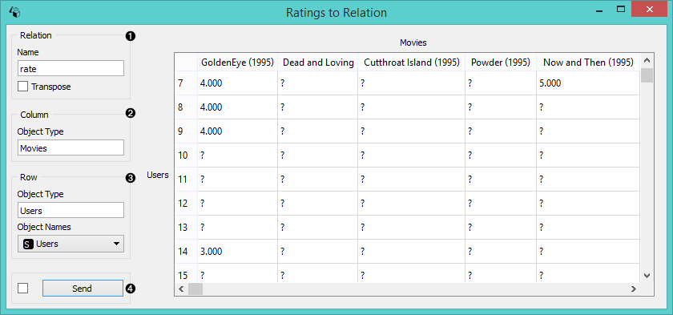
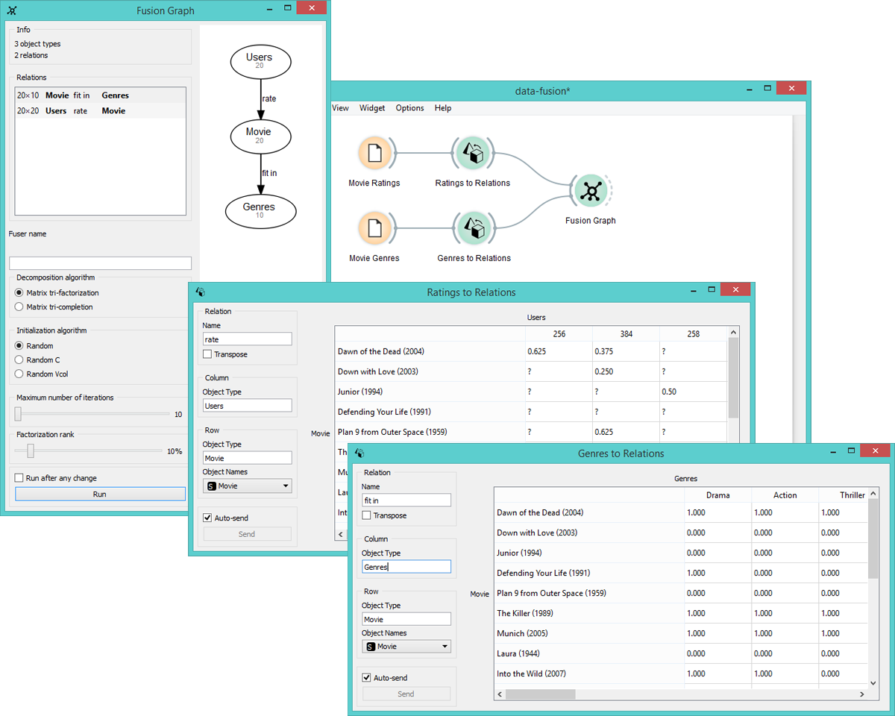

Table to Relation
=================

Converts data table into a relation matrix. Labels matrix axes.

Signals
-------

**Inputs**:

- **Data**

  Attribute-valued data set.

**Outputs**:

- **Relation**

  Relations between two groups of objects.

Description
-----------

**Table to Relation** widget is probably the most important widget in the data fusion set.
This is because this widget allows you to set relations between data sets just by labeling
axes. Your data sets from the **File** widget will become relation matrices, which can be
later fused into a relation graph.

1. Name the relation between the axes. Option [*transpose*](https://en.wikipedia.org/wiki/Transpose)
   will shift the axes.
2. Label the object type in columns. Your entry will be displayed on top of the table. Note that the widget
   distinguishes between upper and lower case.
3. Label the object type in rows. If there is a label present in the data, it will be used as default.
4. If *Auto send is on* is ticked, your changes will be communicated automatically. Alternatively click *Send*.

Example
-------

In the example below we took two regular files with data on movie ratings and movie genres
and fed them into separate **Table to Relation** widgets. In these widgets we set the relations
between the data and named the axes accordingly. See how **Fusion Graph** is then able to construct
connections between data sets simply on the basis of axes names?

