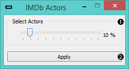

IMDb Actors
===========

.. figure:: icons/imdb-actors.png
   :alt: IMDB Actors widget icon

   IMDB Actors widget icon
Constructs a movies-by-actors or actors-by-actors relation matrix.

Signals
-------

**Inputs**:

-  **Filter**

Data filter.

**Outputs**:

-  **Movie Actors**

A movies-by-actors relation matrix.

-  **Costarring Actors**

An actors-by-actors relation matrix.

Description
-----------

This widget gives you the access to the
`IMDb <https://en.wikipedia.org/wiki/Internet_Movie_Database>`__ data
sets on actors and movies. It outputs either a movies-by-actors relation
matrix, an actors-by-actors relation matrix or both.

   IMDb widget

1. Select how many actors from the IMDb database would you like to
   consider.
2. Click *Apply* to commit your data.

Example
-------

This simple widget is great for learning how data fusion works since it
enables immediate access to the `IMDb
database <https://en.wikipedia.org/wiki/Internet_Movie_Database>`__. To
use it, you need to connect it to **Movie Ratings** widget in the input
and with **Fusion Graph** in the output. This will add the information
on actors in relation to movies. You can view this new data in the
**Data Table** widget.
