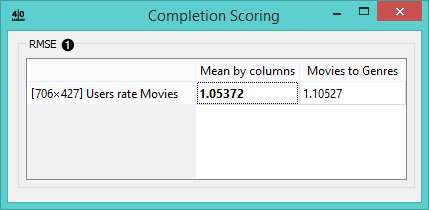

Completion Scoring
==================

.. figure:: icons/completion-scoring.png
   :alt: Completion Scoring widget icon

   Completion Scoring widget icon
Scores the quality of matrix completion using root mean squared error
(RSME) metric.

Signals
-------

**Inputs**:

-  **Fitted fusion graph**

Fitted collective latent data model.

-  **Relation**

Relationships between two groups of objects.

**Outputs**:

-  (None)

Description
-----------

This widget assesses the quality of matrix completion based on root mean
squared error metric
(`RMSE <https://en.wikipedia.org/wiki/Root-mean-square_deviation>`__).
Each row contains scores representing matrix completion quality of
different relations. Results for prediction models are in columns.

   Completion Scoring widget

1. The RMSE value chart for the input relation matrix.

Example
-------

**Completion Scoring** widget assesses the quality of matrix completion
using the RMSE metric. Connect it with **Matrix Sampler** to score
prediction models (previously learnt on in-sample data) on
out-of-the-sample data. You can also use **Mean Fuser** to get a mean
score for latent values.
