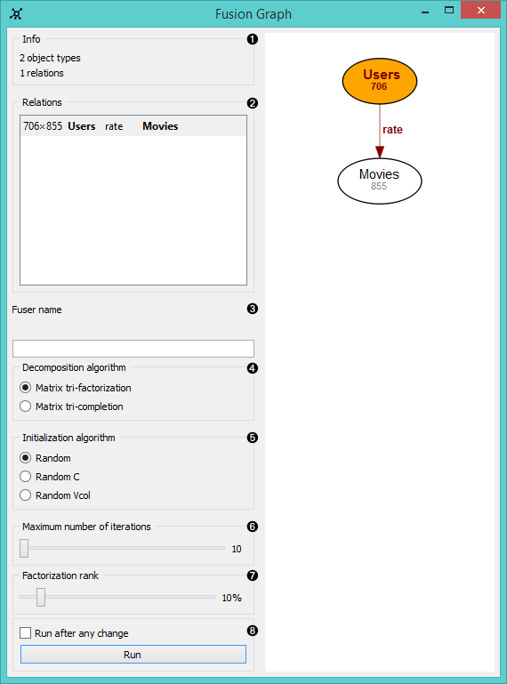
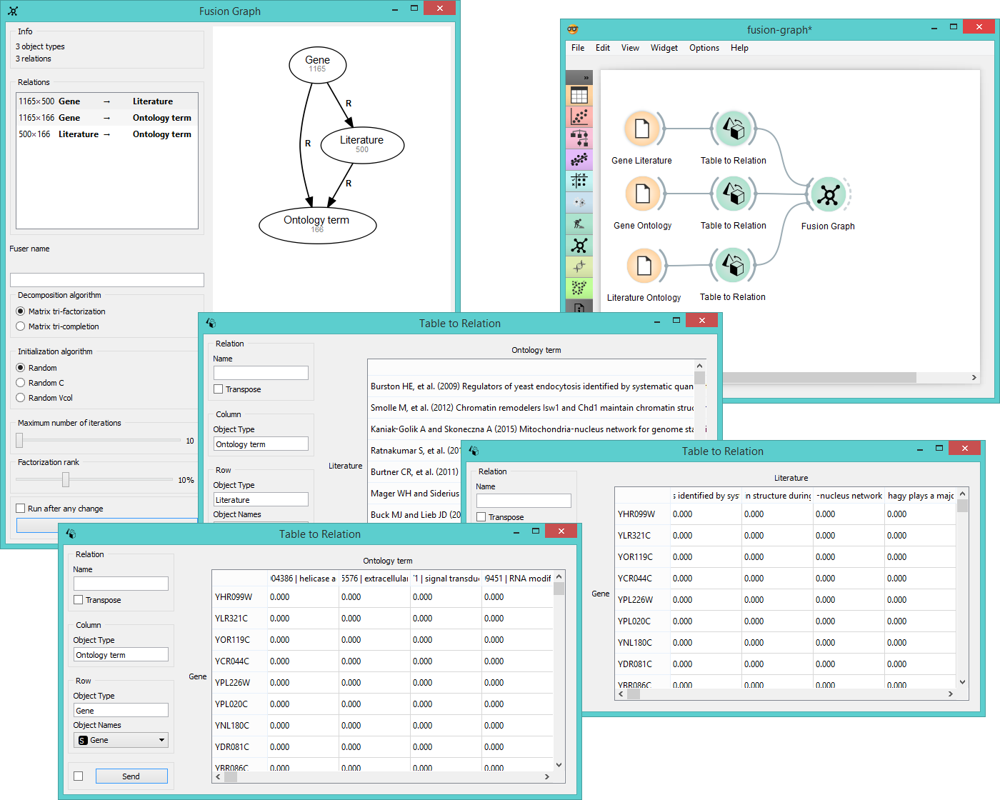

Fusion Graph
============

.. figure:: icons/fusion-graph.png

Constructs a data fusion graph and runs collective matrix factorization
algorithm.

Signals
-------

**Inputs**:

-  **Relation**

   Relationships between two groups of objects.

**Outputs**:

-  **Relation**

   Relationships between two groups of objects.

-  **Fitted Fusion Graph**

   Fitted collective latent data model.

-  **Fusion Graph**

   Input data system.

Description
-----------

**Fusion Graph** widget performs data fusion by collective matrix
factorization. It fuses multiple related data sets into one
comprehensive structure. The widget returns a relational structure of
the entire data system estimated by a collective latent factor approach.

1. Information on the input (object types are nodes, relations are links
   between the nodes).
2. List of identified relations. Click on the relation to output it.
3. Specify a descriptive name for your fusion system.
4. Select the algorithm for
   `factorization <https://en.wikipedia.org/wiki/Non-negative_matrix_factorization>`__:
   
   -  **matrix tri-factorization** decomposes each relation matrix into
      three latent matrices and shares the latent matrices between related
      data sets. Unknown values are imputed prior to collective
      factorization.
   -  **matrix tri-completion** works the same as matrix tri-factorization,
      but does not require relation matrices to be fully observed.
5. Select the *initialization algorithm* for matrix factorization.
6. Set the *maximum number of iterations* used for factorization.
   Default is 10.
7. Set the *factorization rank* (the ratio of data compression based on
   the input data). Default is 10%.
8. If *Run after every change* is ticked, the widget will automatically
   commit changes. Alternatively press *Run*. For large data sets we
   recommend to commit the changes manually.

Example
-------

The example below shows how to fuse several data sets together. Say we
have the data on `ontology terms for many
genes <data-yeast/gene_annotations.tab>`__, `literature on ontology
terms <data-yeast/literature_go.tab>`__ and `literature on
genes <data-yeast/gene_literature.tab>`__. To fuse these data together
we first use **Table to Relation** widget, where we manually set the
object type and relation names. **Fusion Graph** will compile the fusion
graph of our three data sets with connections between object types based
on previously defined data relations, display the connections and run
matrix decomposition algorithm.

